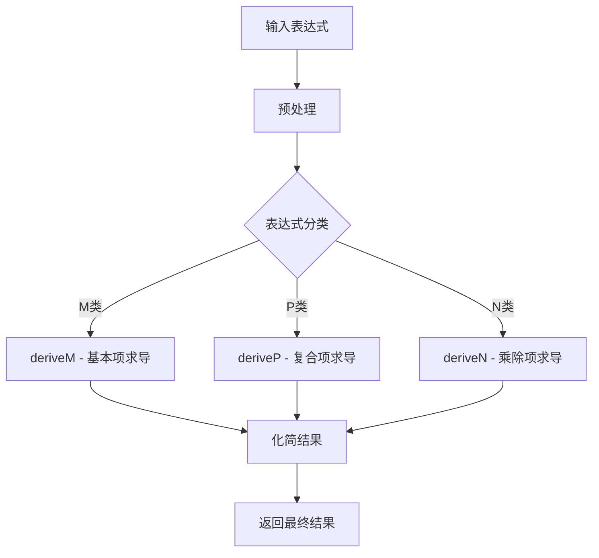
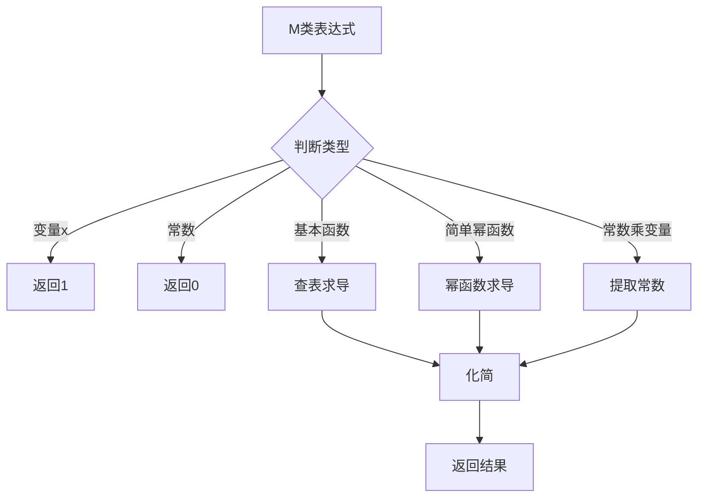
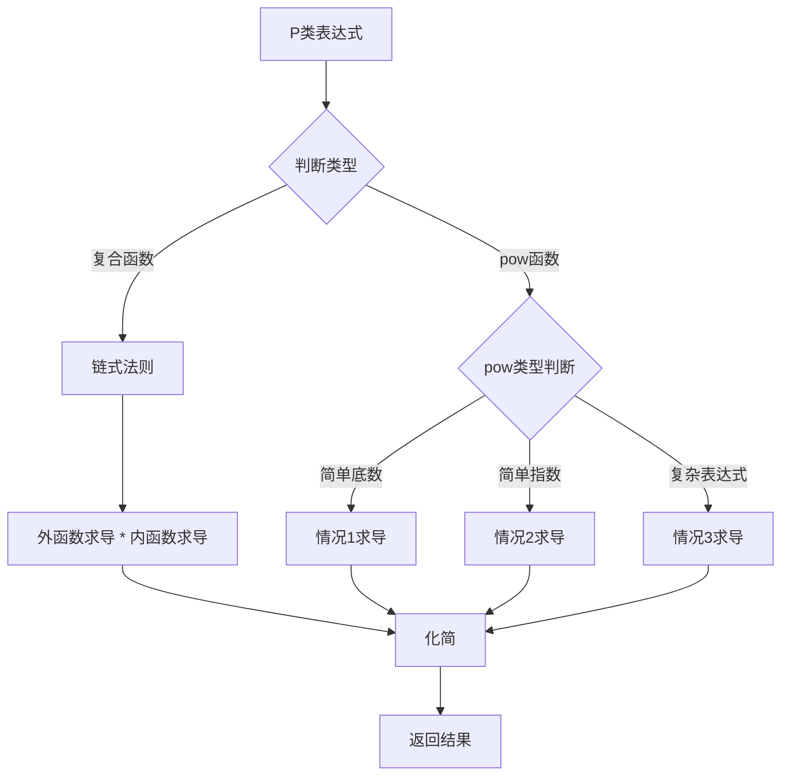
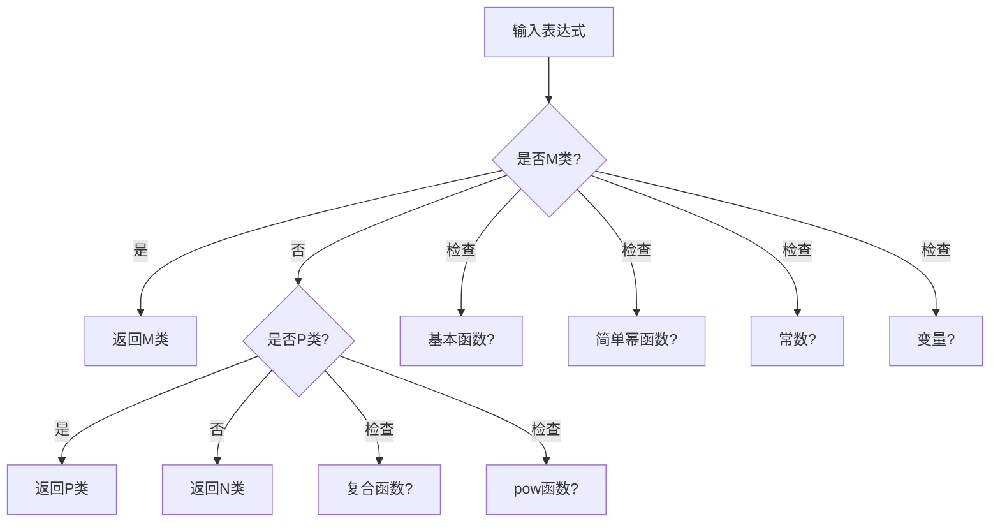
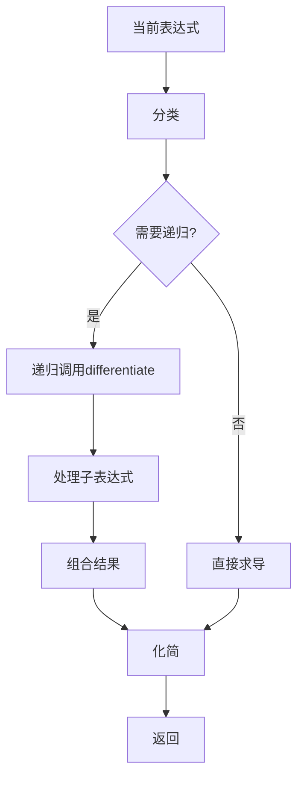

# 符号求导算法流程图

## 🎯 算法概述
本模块实现了完整的符号求导算法，支持基本函数、复合函数、幂函数、乘除运算等多种数学表达式的求导。

## 📊 整体流程图



## 🔍 详细流程

### 1. 预处理阶段


### 2. M类（基本项）求导流程


### 3. P类（复合项）求导流程


### 4. N类（乘除项）求导流程
```mermaid
graph TD
    A[N类表达式] --> B{判断运算符}
    B -->|乘法| C[乘法法则: u'v + uv']
    B -->|除法| D[除法法则: (u'v - uv')/v²]
    C --> E[递归求导u和v]
    D --> E
    E --> F[组合结果]
    F --> G[化简]
    G --> H[返回结果]
```

## 📋 分类判断流程



## 🔄 递归调用机制



## 🧮 化简流程

```mermaid
graph TD
    A[原始结果] --> B[符号化简]
    B --> C[数学化简]
    C --> D[乘法化简]
    D --> E[0删除]
    E --> F[括号处理]
    F --> G[最终结果]
    
    B --> B1[负负得正]
    B --> B2[负正得负]
    
    C --> C1[x/x=1]
    C --> C2[(A)/(A)=1]
    
    D --> D1[移除*1]
    D --> D2[保留常数*变量]
    
    E --> E1[删除+0/-0]
    E --> E2[保留0.x]
```

## 🎯 算法特点

### ✅ 优势
1. **清晰的分类体系** - M/N/P三类明确区分
2. **完整的递归机制** - 支持任意复杂度的表达式
3. **智能的化简算法** - 自动优化结果
4. **高效的括号处理** - 正确处理优先级

### 🔧 核心组件
1. **分类器** - isMClass/isNClass/isPClass
2. **求导器** - deriveM/deriveN/deriveP
3. **化简器** - simplify系列函数
4. **解析器** - 表达式解析和分割

### 📊 复杂度分析
- **时间复杂度**: O(n) - 线性遍历表达式
- **空间复杂度**: O(n) - 递归调用栈
- **递归深度**: 取决于表达式嵌套层数

## 🚀 优化策略

1. **1的省略优化** - 自动移除冗余的*1
2. **符号化简** - 负负得正等规则
3. **数学化简** - x/x=1等恒等式
4. **括号优化** - 智能添加/移除括号

---

*最后更新: 2026-03-22*
*版本: v2.0 - 完整优化版*
