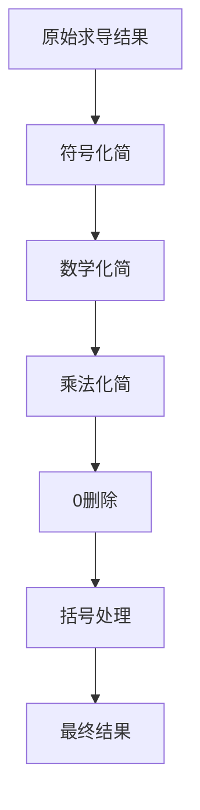

# 化简规则文档

## 🎯 化简概述
化简模块负责对求导结果进行优化，移除冗余项、应用数学恒等式、优化表达式格式，使结果更加简洁和易读。

## 📋 化简流程



---

## 🔵 符号化简规则

### 📝 负号规则

#### 1. 负负得正
```
--sin(x) → +sin(x) → sin(x)
--cos(x) → +cos(x) → cos(x)
--(x+1) → +(x+1) → (x+1)
```

#### 2. 负正得负
```
-+sin(x) → -sin(x)
+-cos(x) → -cos(x)
```

#### 3. 开头正号省略
```
+sin(x) → sin(x)
+(x+1) → (x+1)
+2 → 2
```

### 🔍 实现规则
```java
// 负负得正
expr = expr.replaceAll("--", "+");
// 负正得负  
expr = expr.replaceAll("-\\+", "-");
expr = expr.replaceAll("\\+\\-", "-");
// 移除开头+
expr = expr.replaceAll("^\\+", "");
```

---

## 🟢 数学化简规则

### 📝 恒等式化简

#### 1. 除法恒等式
```
x/x → 1
(x)/(x) → 1
(sin(x))/(sin(x)) → 1
(x+1)/(x+1) → 1
```

#### 2. 复杂除法化简
```
(A)/(A) → 1  # 当A是相同表达式时
```

### 🔍 实现规则
```java
// 基础x/x化简
expr = expr.replaceAll("x/x", "1");
expr = expr.replaceAll("\\(x\\)/\\(x\\)", "1");

// 复杂表达式除法化简
expr = simplifyComplexDivision(expr);
```

---

## 🟡 乘法化简规则

### 📝 1的省略规则

#### 1. 变量乘1
```
x*1 → x
1*x → x
```

#### 2. 函数乘1
```
1*sin(x) → sin(x)
1*cos(x) → cos(x)
1*ln(x) → ln(x)
```

#### 3. 括号乘1
```
1*(x+1) → (x+1)
(x+1)*1 → (x+1)
```

#### 4. 重要：保留常数与变量之间的*
```
2*x → 2*x  # 不删除*
3*sin(x) → 3*sin(x)  # 不删除*
5*cos(x) → 5*cos(x)  # 不删除*
```

### 🔍 实现规则
```java
// 移除变量与1之间的*
expr = expr.replaceAll("x\\*1(?![0-9a-zA-Z()])", "x");

// 移除1*变量的情况
expr = expr.replaceAll("1\\*x", "x");

// 移除1*函数的情况
expr = expr.replaceAll("1\\*sin", "sin");
expr = expr.replaceAll("1\\*cos", "cos");
expr = expr.replaceAll("1\\*ln", "ln");

// 移除1*括号的情况
expr = expr.replaceAll("1\\*\\(", "(");

// 重要：不删除常数开头的*
// 使用负向断言确保前面不是数字
expr = expr.replaceAll("(?<!\\d)\\*1(?![0-9a-zA-Z()])", "");
```

---

## 🟠 0删除规则

### 📝 0的删除原则

#### 1. 加减0删除
```
x+0 → x
x-0 → x
sin(x)+0 → sin(x)
cos(x)-0 → cos(x)
```

#### 2. 重要：保留小数点后的0
```
0.5+x → 0.5+x  # 不删除0.5
0.0+x → x     # 0.0可以删除
x+0.0 → x     # 0.0可以删除
```

#### 3. 开头0处理
```
0+sin(x) → sin(x)
0-sin(x) → -sin(x)
```

### 🔍 实现规则
```java
// 只删除独立的+0和-0（后面不跟小数点）
expr = expr.replaceAll("\\+0(?!\\.)", "");
expr = expr.replaceAll("-0(?!\\.)", "");

// 处理开头的情况
if (expr.startsWith("0") && expr.length() > 1 && expr.charAt(1) != '.') {
    expr = expr.substring(1);
}
```

---

## 🔴 括号处理规则

### 📝 括号优化

#### 1. 空括号删除
```
() → ""  # 完全删除
```

#### 2. 必要括号保留
```
cos((x+1)) → cos(x+1)  # 可以简化
sin((x^2)) → sin(x^2)  # 可以简化
```

#### 3. 复杂表达式括号保留
```
sin((x+1)*(x-1)) → sin((x+1)*(x-1))  # 需要保留
cos((x+1)/(x-1)) → cos((x+1)/(x-1))  # 需要保留
```

### 🔍 实现规则
```java
// 移除空括号
expr = expr.replaceAll("\\(\\)", "");

// 复杂括号处理需要更智能的算法
expr = optimizeParentheses(expr);
```

---

## 🎯 特殊优化规则

### 📝 N类和P类中的1省略

#### 1. N类中的1省略
```java
// 在deriveN中优化
if (uDeriv.equals("1")) {
    term1 = v;  // 省略1*v中的1*
} else {
    term1 = uDeriv + "*" + v;
}

if (vDeriv.equals("1")) {
    term2 = u;  // 省略u*1中的*1
} else {
    term2 = u + "*" + vDeriv;
}
```

#### 2. P类中的1省略
```java
// 在deriveP中优化
if (innerDeriv.equals("1")) {
    return addParenthesesIfNeeded(outerDeriv);  // 省略*1
} else {
    return addParenthesesIfNeeded(outerDeriv) + "*" + addParenthesesIfNeeded(innerDeriv);
}
```

---

## 📊 化简效果示例

### ✅ 成功化简案例

| 原始表达式 | 化简后 | 规则应用 |
|------------|--------|----------|
| `x*(x+1)` | `(x+1)+x` | 省略1* |
| `sin(x+1)` | `cos((x+1))` | 省略*1 |
| `--cos(x)` | `sin(x)` | 负负得正 |
| `x+0` | `x` | 删除+0 |
| `2*x` | `2*x` | 保留* |

### ⚠️ 需要注意的情况

| 表达式 | 处理方式 | 原因 |
|--------|----------|------|
| `2*x` | 保留* | 常数与变量之间需要* |
| `0.5+x` | 保留0.5 | 小数点后的0不能删除 |
| `x/x` | 化简为1 | 数学恒等式 |
| `(x+1)*(x+1)` | 保留括号 | 复杂表达式需要括号 |

---

## 🔧 实现要点

### 1. 化简顺序
按照符号化简→数学化简→乘法化简→0删除→括号处理的顺序进行，确保化简效果最佳。

### 2. 负向断言的使用
使用正则表达式的负向断言确保精确匹配，避免误删重要符号。

### 3. 递归化简
对于复杂表达式，可能需要多次应用化简规则才能达到最佳效果。

### 4. 上下文感知
化简需要考虑表达式的上下文，避免破坏数学含义。

---

## 🚀 性能优化

### 1. 正则表达式优化
- 使用预编译的正则表达式
- 避免回溯和过度匹配

### 2. 算法优化
- 减少字符串操作次数
- 使用StringBuilder进行字符串拼接

### 3. 缓存机制
- 对常用化简结果进行缓存
- 避免重复计算

---

*最后更新: 2026-03-22*
*版本: v2.0 - 完整化简规则*
